## 📂 GrooBear - 그룹웨어 협업 시스템

> 팀 협업과 프로젝트 관리를 통합한 웹 기반 그룹웨어 시스템입니다.
> 
> 실시간 알림, Gantt & Kanban 보드, 프로젝트 다단계 등록 등 실제 조직 업무에 최적화된 기능을 구현했습니다.
> 
> 다른 기능으로는 실시간 채팅, 전자결재, 메일, 일정관리, 커뮤니티 게시판 등이 있습니다.

---
 

## 🗂 ERD 설계

> 전체 테이블 구조를 시각화한 ERD입니다.  
> 이미지가 클 경우 클릭하여 원본 크기로 보세요.

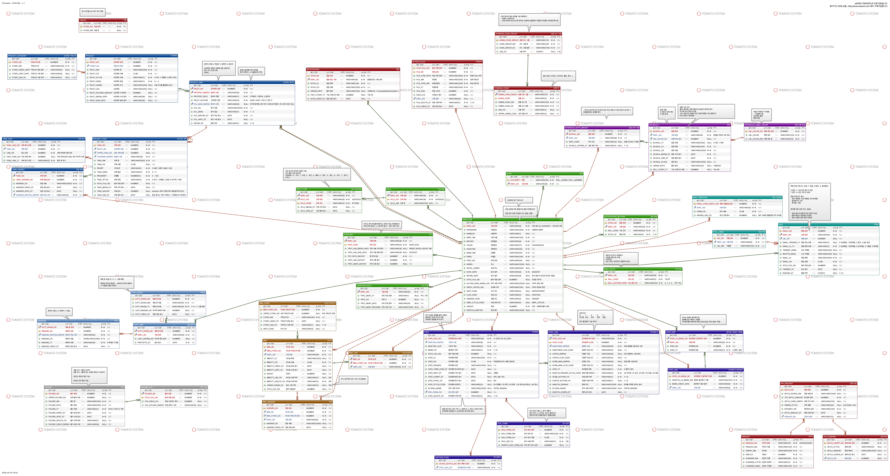

---
 

## 📽️ 전체 시연 미리보기

<strong>▶️ 클릭해서 전체 시연 GIF 펼쳐보기</strong>

 

## 🖥 메인 페이지

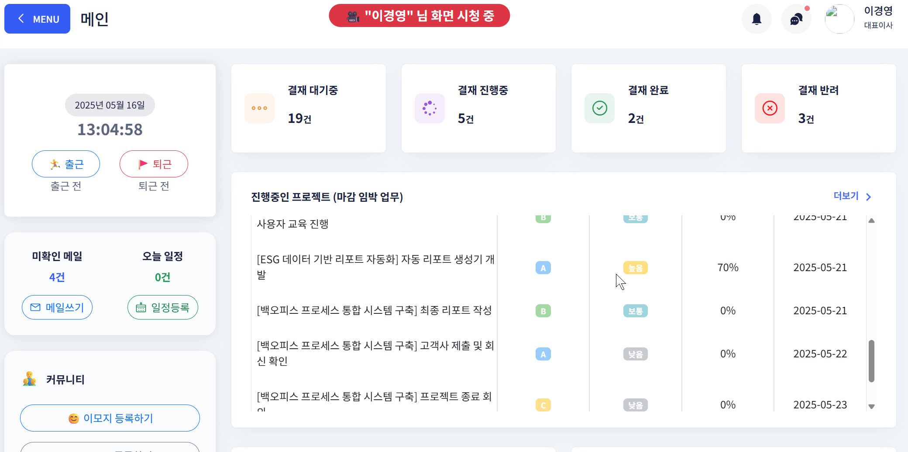

---
 

## 📊 대시보드 (탭1)

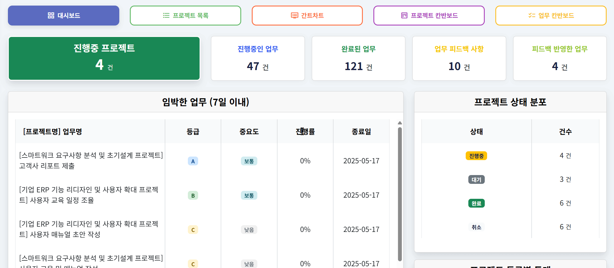

---

## 📁 프로젝트 목록 (탭2)

### 🔸 삭제 기능
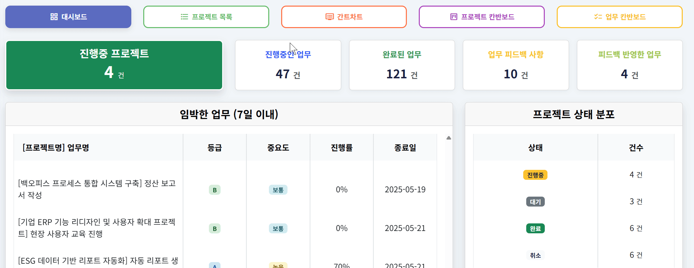

### 🔸 필터 검색
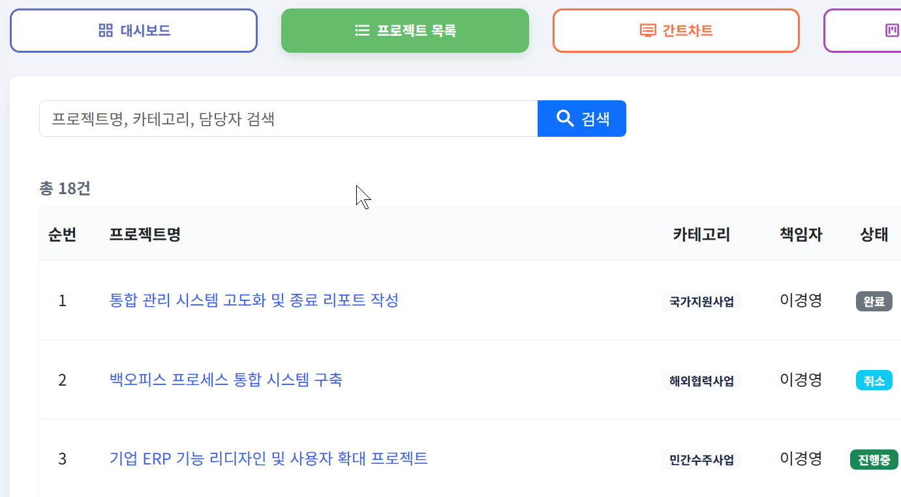

### 🔸 엑셀 다운로드
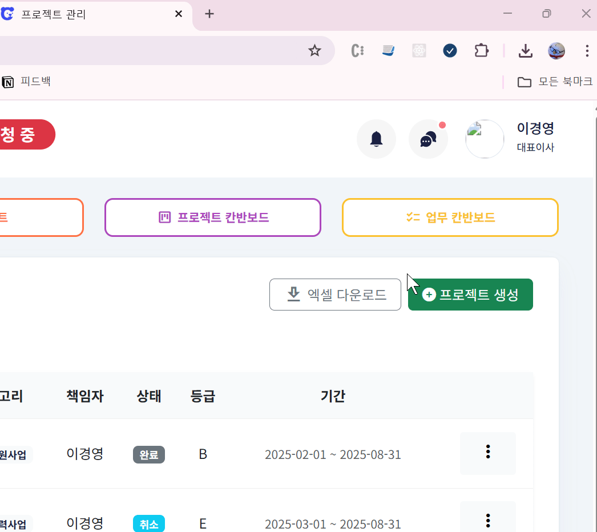

📎 결과 예시:
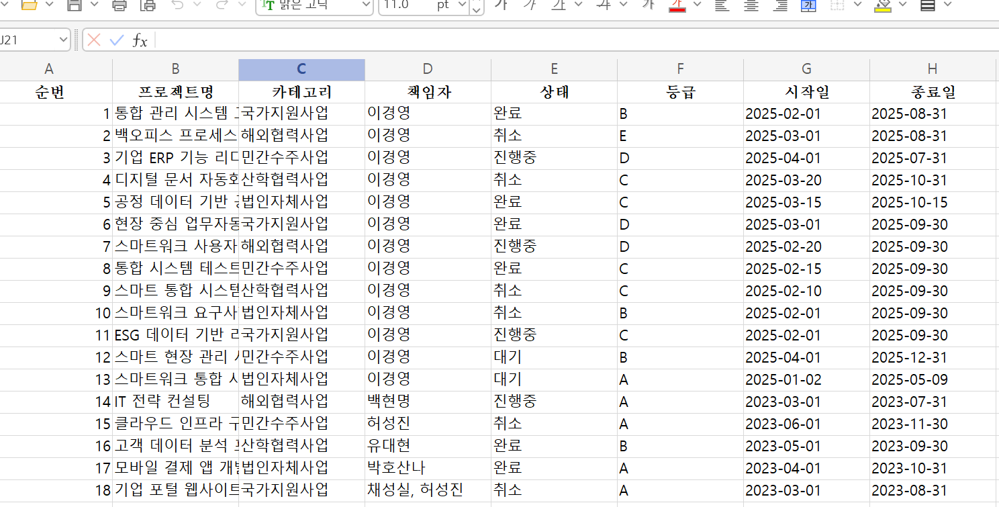

---

## 📝 프로젝트 생성 (탭2)

### 🔸 Step1 ~ Step4 입력 단계
- 기본 정보, 참여자 등록, 업무 등록, 주소 및 금액 설정, 최종 확인까지 포함

| Step | 미리보기 |
|------|----------|
| Step1 | 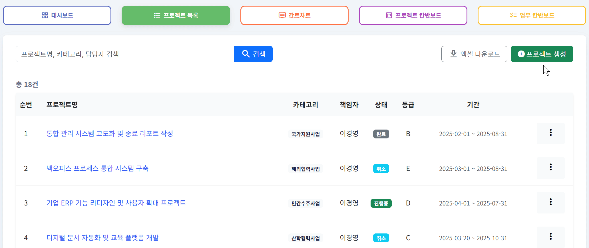 |
| Step2 | 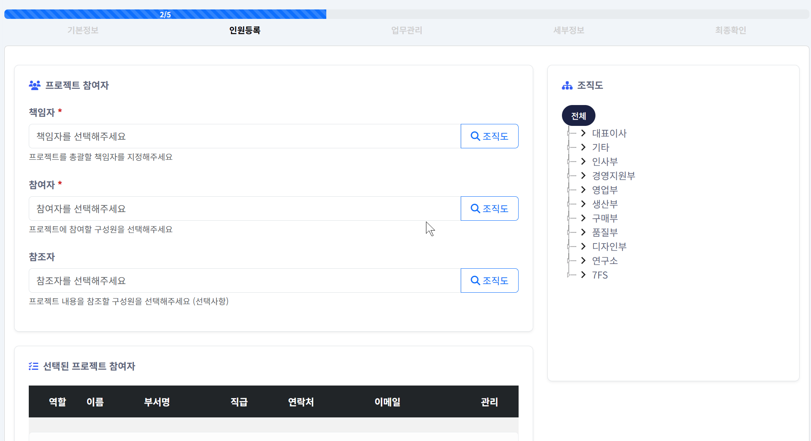 |
| Step3 |  |
| Step4 | 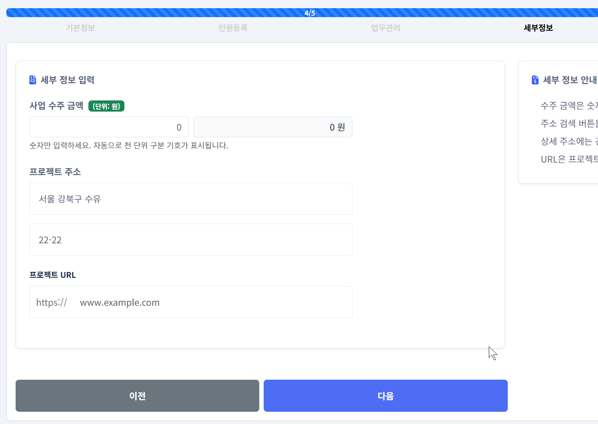 |

---

## 🔍 프로젝트 상세 보기

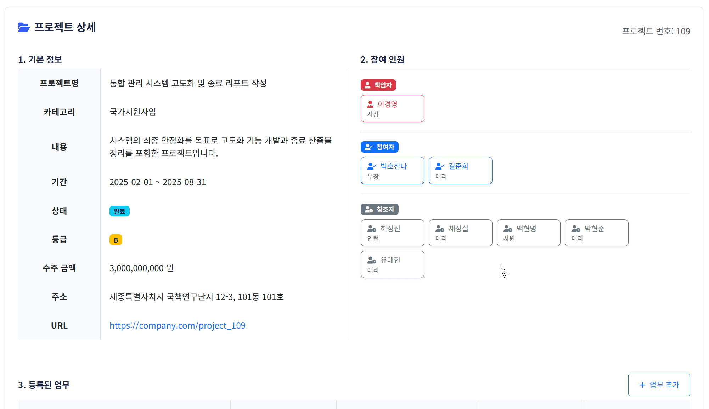

📎 업무 추가 화면:
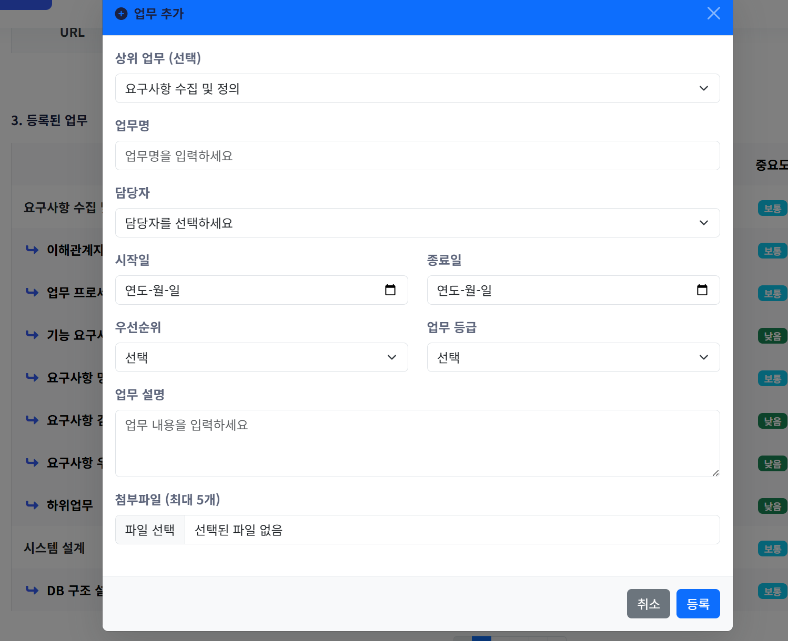

---

## 🛠 프로젝트 수정

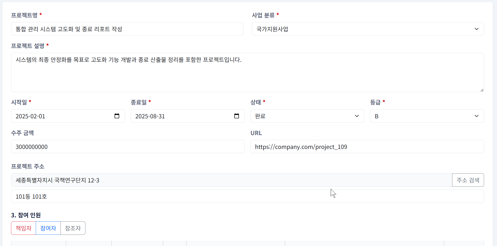

---

## 📈 Gantt 차트 (탭3)

| 설명 | 예시 |
|------|------|
| 간트 기본 구성 | 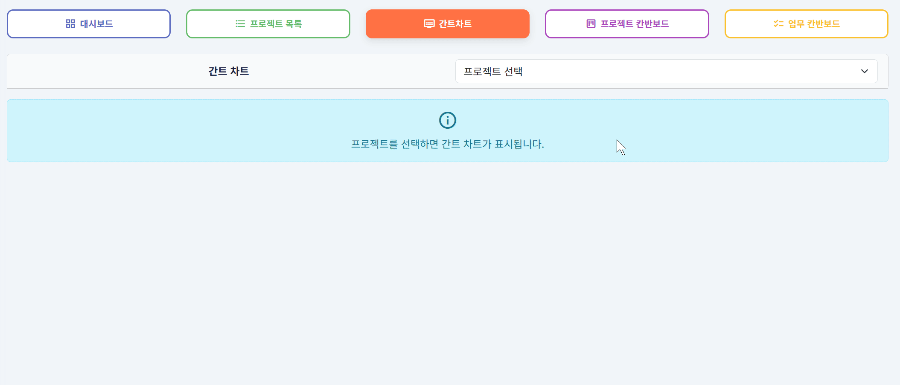 |
| 간트 상세보기 | 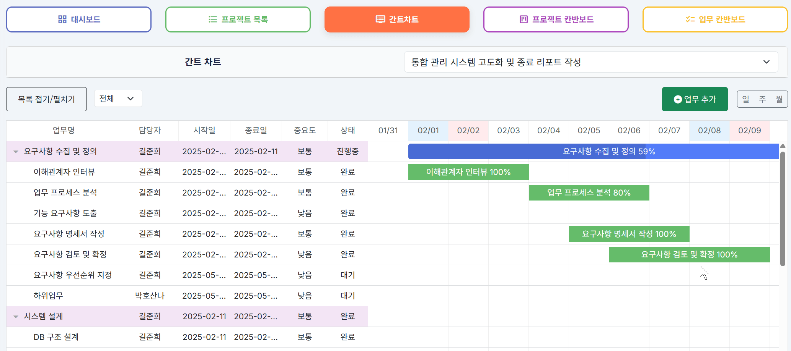 |

---

## 🗂 프로젝트 칸반 보드 (탭4)

---

## ✅ 업무 칸반 보드 (탭5)

| 구분 | 미리보기 |
|------|-----------|
| 업무 상태별 이동 |  |
| 업무 상세 보기 | 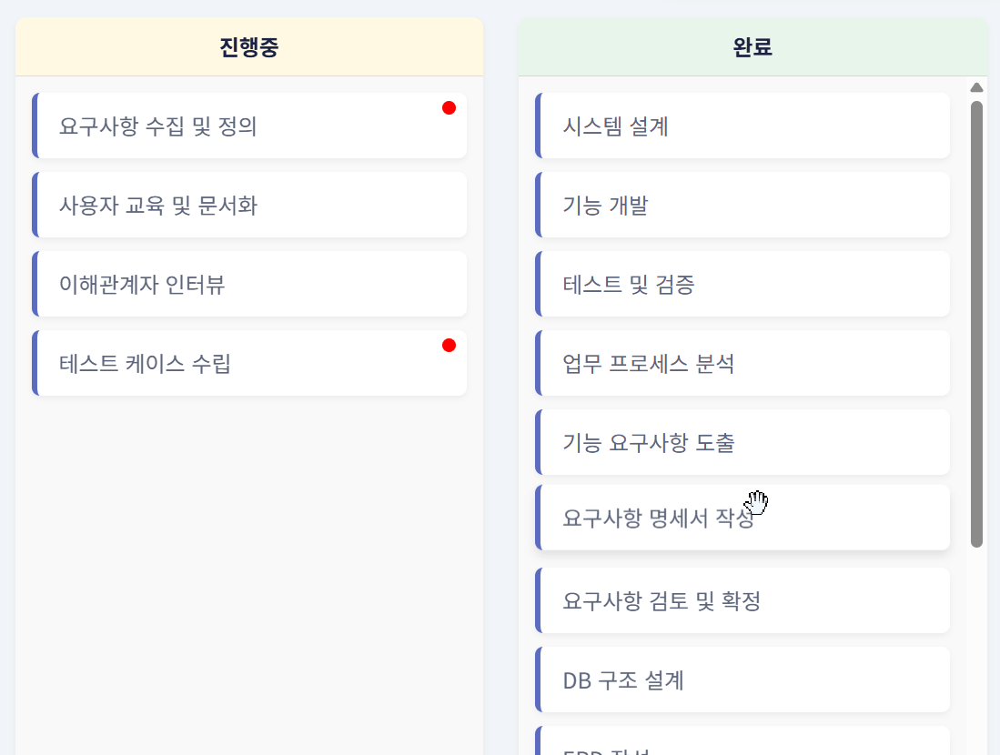 |

 

---

## 📌 기술 스택

| 분야 | 기술 스택 |
|------|------------|
| 🖼️ Frontend |      |
| ⚙️ Backend |     |
| 🗄️ Database |  |
| 🧩 기타 |     |

---

## 👩‍💻 담당 역할

- 프로젝트 전체 구조 설계 및 백엔드 구현 주도
- 프로젝트 5단계 입력 + 업무 구조 + 실시간 알림 기능 구현
- Gantt/ Kanban 연동, 업무 상태 전환 및 시각화 UI 설계
- 대시보드 데이터 통계 및 Excel 다운로드 구현

---

 

## 🛠 트러블슈팅

# 🛠️ 프로젝트 트러블슈팅 & 회고 정리

---

## 🟧 ① VO 설계의 구조와 포맷 충돌 문제

### 문제 상황
업무(Task) 데이터를 다루는 Gantt, Kanban, 일반 CRUD 화면은 각각 다른 목적과 표현 방식을 가지고 있었고,
처음에는 이를 하나의 VO (`ProjectTaskVO`)로 통합해 처리하려 했습니다.

하지만 실제 구현 과정에서 두 가지 유형의 충돌이 발생했습니다:

**1. 구조 충돌**  
Gantt는 `start_date`, `end_date`, `parent` 같은 시각화 전용 필드명을 요구했지만,  
기존 VO에는 `taskBeginDt`, `taskEndDt`, `upperTaskNo`처럼 내부 로직 중심의 필드명만 존재해  
JSON 직렬화 시 매핑이 되지 않거나 화면 출력이 실패했습니다.

**2. 포맷 충돌**  
날짜 필드의 타입과 표현 형식이 각 화면마다 달랐습니다.  
Gantt는 `"yyyy-MM-dd"` 문자열 포맷을 요구했지만,  
일반 화면은 `LocalDate` 기반 객체 처리, Kanban은 단순 출력만 필요해  
하나의 타입으로는 모두를 만족시키기 어려웠습니다.  
그 결과, 타입 불일치 오류, 직렬화 실패, null 출력 등의 문제가 발생했습니다.

### 해결 방법

1. 기능별 요구사항을 기준으로 VO를 분리하여  
   `GanttTaskVO`, `KanbanTaskVO`, `ProjectTaskEntity`로 명확하게 나누고,  
   공통 필드는 `TaskInterface`를 통해 일관된 접근이 가능하도록 구성했습니다.

2. 날짜 관련 필드는 화면 성격에 따라 처리 방식을 구분했습니다.  
   Gantt 전용 VO에서는 `String`으로 선언하고 `@JsonProperty`로 키를 명시적으로 매핑했으며,  
   CRUD용 VO는 `LocalDate`를 유지하면서 `@JsonFormat`을 활용해 직렬화 오류를 방지했습니다.

3. 출력용 포맷이 필요한 경우에는 `getTaskBeginDateFormatted()`와 같은 전용 Getter를 따로 만들어  
   프론트에서 사용되는 형식과 백엔드 저장 구조를 명확히 분리했습니다.

### 느낀점
처음에는 “하나의 VO로 모두 처리하면 관리가 쉬울 것”이라 생각했지만,  
오히려 기능 간 충돌이 생기고 디버깅 시간이 늘어나며 유지보수가 어려워졌습니다.

이번 경험을 통해,

- 기능의 목적이 다르면 데이터 구조도 분리되어야 하고,  
- 같은 필드(예: 날짜)라도 화면마다 요구하는 표현 방식이 다르면  
  VO는 구조적·표현적 책임을 명확히 나눠야 한다는 것을 절실히 깨달았습니다.

앞으로는 API나 화면 요구사항을 먼저 정리하고,  
그에 맞는 VO 설계를 기능 중심으로 명확하게 구분하는 기준을 갖고 개발에 임할 계획입니다.

---

## 🟧 ② Ajax 기반 다단계 입력 설계 및 상태 관리

### 문제 상황
초기에는 프로젝트 등록 화면을 `insert.jsp` 하나로 구성하여  
모든 항목(기본정보, 참여자, 업무, 추가정보, 확인)을 한 페이지에서 입력하도록 만들었지만,  
기능이 많아질수록 JSP 코드가 지나치게 길어지고 유지보수가 어려워지는 문제가 발생했습니다.

이후 입력 단계를 `step1`부터 `step5`까지 분리해 각각 담당 기능별로 JSP 파일을 나누었고,  
탭 구조로 연결하여 SPA처럼 동작하게 했습니다.  
그러나 분리 후에는 또 다른 문제가 발생했습니다.  
Ajax 방식으로 페이지가 전환되다 보니, 각 스텝에서 입력한 데이터가 다음 단계로 제대로 전달되지 않거나,  
최종 제출 시 누락된 값이 `undefined`로 넘어가는 현상이 자주 발생했습니다.

예를 들어, Step2에서 선택한 참여자 정보가 Step3 업무 등록 단계에서 사라지거나,  
Step1에서 입력한 프로젝트 기본 정보가 최종 Step5에서 전송되지 않는 문제가 있었습니다.

### 해결 방법

1. 각 스텝에서 입력되는 데이터를 하나의 JavaScript 전역 객체  
   (`projectData`, `taskList`, `memberList` 등)에 누적 저장하도록 설계 구조를 변경했습니다.

2. 탭 전환 시 DOM에서 직접 값을 읽어 저장하고,  
   최종 제출 버튼 클릭 시 이 객체들을 JSON으로 직렬화해 통합 전송했습니다.

3. 또한 각 단계 진입 시 기존 저장값을 다시 화면에 반영하도록  
   `loadFormValues()`와 같은 재렌더링 함수를 추가해 UX 일관성을 확보했습니다.

### 느낀점
다단계 입력폼은 단순히 화면을 나누는 것이 아니라,  
입력된 상태를 구조적으로 관리하는 로직이 반드시 함께 설계되어야 한다는 걸 배웠습니다.  
SPA처럼 동작하는 Ajax 구조에서는 브라우저 새로고침 없이 상태가 유지돼야 하기 때문에,  
전역 상태 관리 객체 설계와 전환 간 데이터 검증 로직이 필수적입니다.

이번 경험을 통해, **UI 흐름만큼 중요한 것은 데이터 흐름**이라는 사실을 체감했고,  
향후 다단계 또는 SPA 구조의 폼을 구현할 때는 처음부터 상태 관리 전략까지 함께 설계하겠다는 기준이 생겼습니다.

---

## 🟧 ③ 칸반보드 상태별 업무 수 실시간 반영 실패

### 문제 상황
칸반보드에서 업무 카드를 드래그 앤 드롭하여 상태를 변경하면  
DB에는 정상적으로 상태가 업데이트되지만,  
상단에 표시되는 업무 상태별 요약 카운트(예: 대기 3건, 진행 5건 등)가  
즉시 반영되지 않고 이전 상태로 남아 있는 UX 오류가 발생했습니다.

이 문제는 사용자 입장에서 “상태 이동이 실패한 것처럼 보이는 혼란”을 줄 수 있었고,  
특히 한 화면에서 여러 업무를 연속 이동할 때  
실제 데이터와 화면 정보 간 불일치 문제가 커졌습니다.

### 해결 방법
Drag & Drop 이벤트를 처리하는 JavaScript 함수에서  
DB 상태 업데이트 요청(AJAX) 후, 응답이 성공일 경우 다음 로직을 추가했습니다:

1. 상단 상태별 업무 수 요약 카운트를 다시 조회하는 Ajax 요청을 수행하고  
2. 반환된 값을 기반으로 각 상태별 카운트를 실시간으로 다시 렌더링하도록  
   `updateTaskCountSummary()` 함수를 구현했습니다.

또한 `drop()` 이벤트 내에서 업무 카드 이동 후 이 함수가 반드시 실행되도록 보장하여  
UI와 DB 간 싱크를 유지했습니다.

### 느낀점
이 경험을 통해 **프론트에서 “정상 동작”이란 단순히 기능이 수행되는 것이 아니라,  
그 결과가 사용자의 눈에도 ‘제대로 반영됐구나’ 하고 보이는 것까지 포함된다는 걸 체감**했습니다.

특히 Ajax 기반 UI에서는 사용자가 곧바로 시각적 피드백을 받지 않으면  
**데이터는 맞아도 심리적으로 오류처럼 느껴질 수 있다는 UX의 중요성**을 알게 되었습니다.

이후에는 상태 변경이나 삭제 같은 액션 이후에는  
**요약 정보, 목록, 배지 등의 연계 요소도 함께 업데이트되도록** 처리 우선순위를 조정하게 되었습니다.
  
 

 
 

## 📘 프로젝트 회고

### ✅ 기술적으로 성장한 부분

- 실시간 알림 시스템(WebSocket) 구현을 통해 **동기화된 사용자 경험 설계**에 대한 이해도를 높임
- 단일 JSP 페이지에서 탭별 기능을 구성하며 **AJAX 기반 SPA 유사 구조 구현 경험**을 축적
- VO 분리(GanttTaskVO / KanbanTaskVO / ProjectTaskEntity)를 설계하며 **도메인별 책임 분리와 확장성**을 고려한 설계 경험

 
🌙──────────────────────────────

### 🤝 협업에서 배운 점

- 참여자 역할 정리 및 브랜치 전략을 통해 **업무 충돌 없이 협업 관리** 가능함을 경험
- 주도적으로 문서화와 회의 정리를 하며 팀원 간 커뮤니케이션의 중요성을 체감

 
🌙──────────────────────────────

### 💡 개선하고 싶은 점

- 디자인과 반응형 레이아웃 설계에서 부족함을 느껴 프론트엔드 영역에 대한 감각과 리팩토링 경험을 더 늘릴 필요가 있음
- DB 설계 초기에 정규화/반정규화 판단 기준이 부족했음 → 더 많은 ERD 구조 사례 학습 예정

 
🌙──────────────────────────────

### 🧠 개인적인 성장

> "개발은 단순히 기능을 만드는 것이 아니라, 사용자와 팀을 이해하고 **끝까지 작동하게 만드는 과정**이다."  
> 프로젝트를 통해 **끝까지 책임지고 마무리하는 개발자**의 자세를 다졌다고 생각합니다.

 

## 🔗 관련 링크

- 🧾 [포트폴리오 메인 페이지](https://seongsil-chae.github.io/portfolio/)
- 📦 [GitHub 저장소](https://github.com/SeongSil-Chae/GrooBear)
